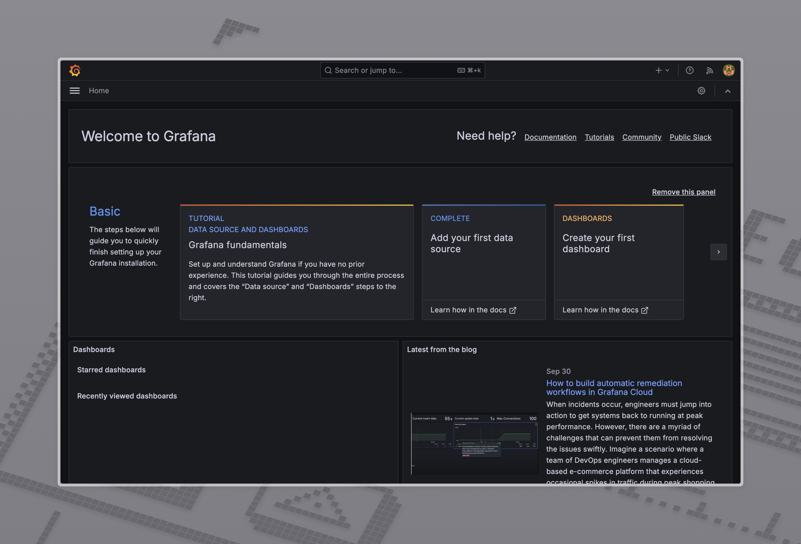
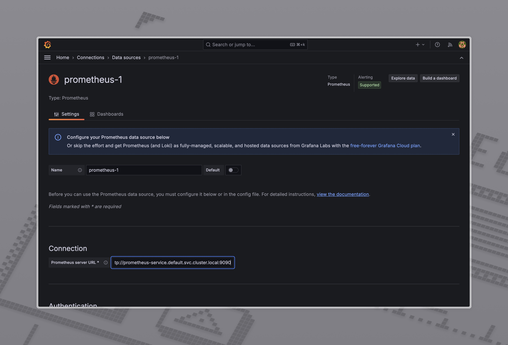
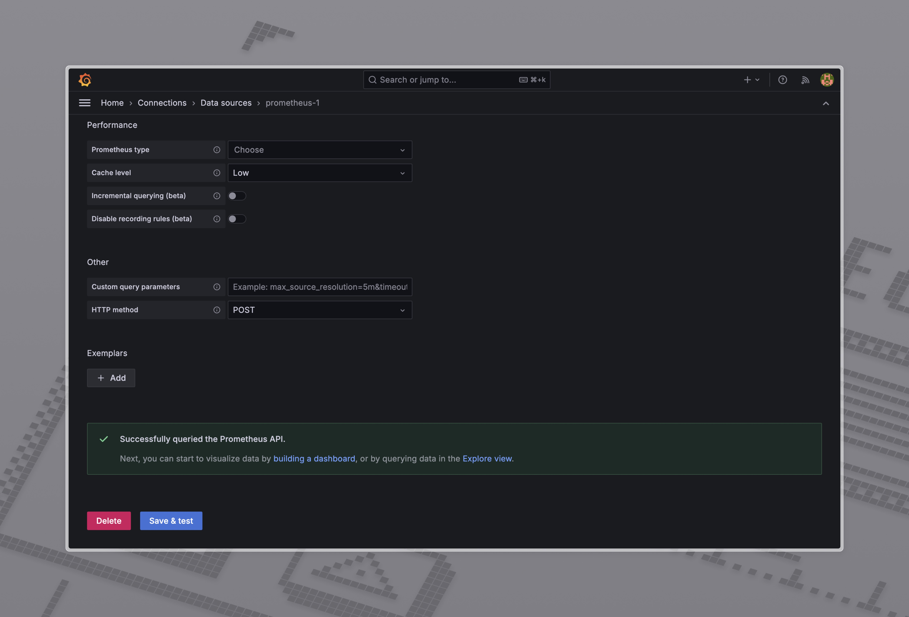

# observability-k8s
Simple observability setup for Kubernetes using Prometheus, Grafana for go api server

## Prerequisites

- Install [Minikube](https://minikube.sigs.k8s.io/docs/start/)
- Install [kubectl](https://kubernetes.io/docs/tasks/tools/install-kubectl/)
- Docker installed and running locally
- Install [Go](https://golang.org/doc/install)

## Steps

### 1. Start Minikube

Start Minikube with the following command:

```bash
minikube start
```

### 2. Build the Docker Image

Use Minikube's Docker environment to build the image:

```bash
eval $(minikube docker-env)
docker build -t go-app:metrics .
```

### 3. Deploy the Application

Apply the deployment and service configuration files:

```bash
kubectl apply -f deployment.yaml
kubectl apply -f service.yaml
```
To test the application, run the following command:

```bash
minikube service go-app-service
```
And check the ping endpoint

### 4. Deploy Prometheus and Grafana

Apply the Prometheus and Grafana configuration files:

```bash
kubectl apply -f ./prometheus/deployment.yaml
kubectl apply -f ./prometheus/service.yaml
kubectl apply -f ./prometheus/configmap.yaml
kubectl apply -f ./grafana/deployment.yaml
kubectl apply -f ./grafana/service.yaml
```

### 5. Access Grafana

To access Grafana, run the following command:

```bash
minikube service grafana-service
```

The default username and password are `admin`.

You should see the Grafana home page:



### 6. Add Prometheus as a Data Source

1. Go to `Configuration` > `Data Sources` > `Add data source`.
2. Select `Prometheus`.
3. Set the URL to `http://prometheus-service.default.svc.cluster.local:9090`.

4. Click `Save & Test`.


### 7. Build the Dashboard

1. Click on the `+` icon on the left sidebar.
2. Click on `New Dashboard`.
3. Click on `Add visualisation`.
4. Build the dashboard using the Prometheus data source.
5. You can use the following query to get the metrics:

```bash
avg_over_time(go_app_health_status[5m]) * 100
```
It will show the healthy status percentage of the go app server over the last 5 minutes.
To test it you can use /unhealthy endpoint of the go app server to see the percentage drop.

```bash
up{job="go-app"}
```
It will show the uptime of the go app server.

### 8. Add Error Logs to the Dashboard
To add logs to the Grafana dashboard, we need to deploy the Loki and Promtail components.
For more details, check the [log.md](log.md) file.
