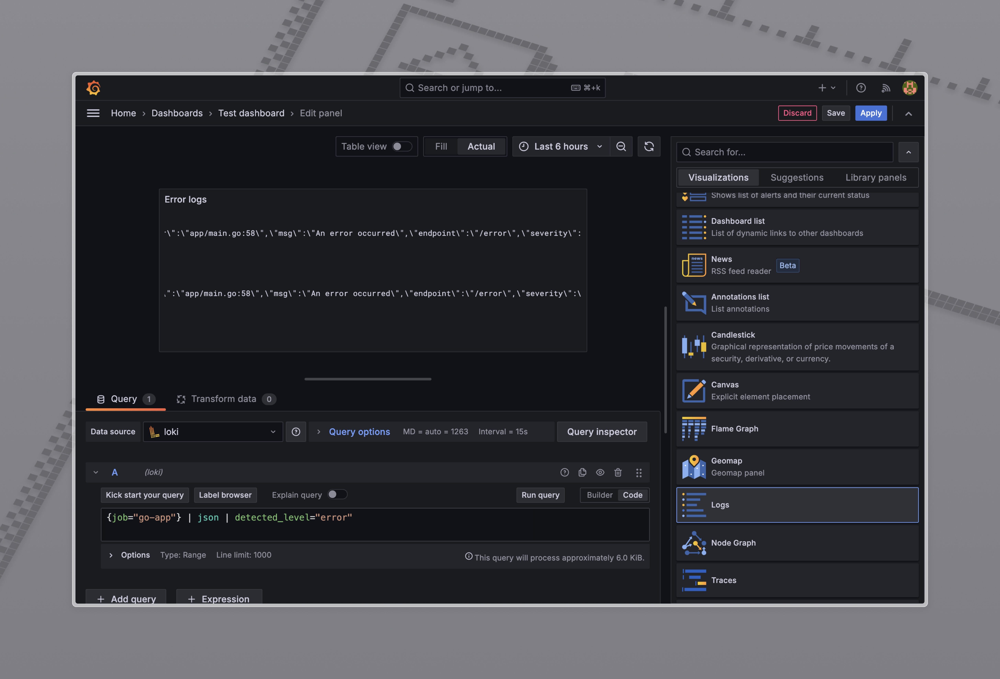
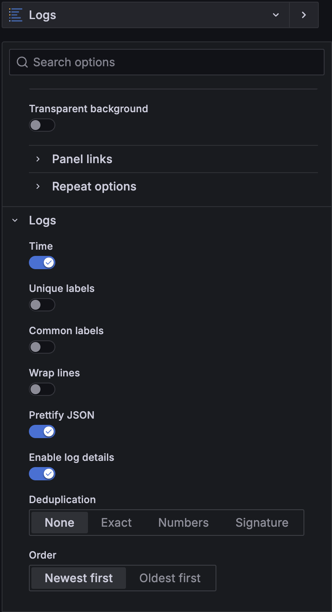
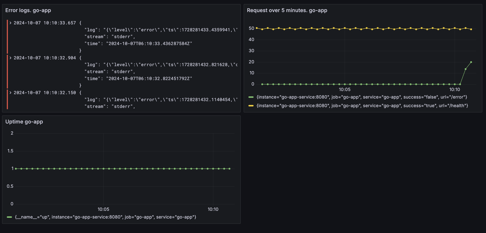

To add logs to the Grafana dashboard, we need to deploy the Loki and Promtail components.

### 1. Deploy Loki and Promtail to k8s
```bash
kubectl apply -f ./loki/configmap.yaml
kubectl apply -f ./loki/deployment.yaml
kubectl apply -f ./loki/service.yaml
kubectl apply -f ./loki/persistentvolume.yaml
kubectl apply -f ./promtail/configmap.yaml
kubectl apply -f ./promtail/daemonset.yaml

kubectl apply -f ./promtail/service.yaml # optional
```

### 2. Add Loki datasource to Grafana
- Open Grafana in your browser
- Go to Configuration -> Data Sources
- Click on "Add data source"
- Choose "Loki" from the list
- Set the URL to `http://loki:3100`
- Click "Save & Test"

### 3. Add error logs to the dashboard
- Open the dashboard you want to add logs to
- Click on "Add panel"
- Choose "Logs" from the list

- Set the query to {job="go-app"} | json | detected_level="error"
- Modify options as needed. Example:

- Click "Apply"

- To generate some errors in the go-app you can use /error endpoint.
These kinds of logs can be useful for monitoring and aggregating (and filtering by certain criteria like level) logs.
It's possible to add new targets to the Promtail config map to collect logs from other sources.